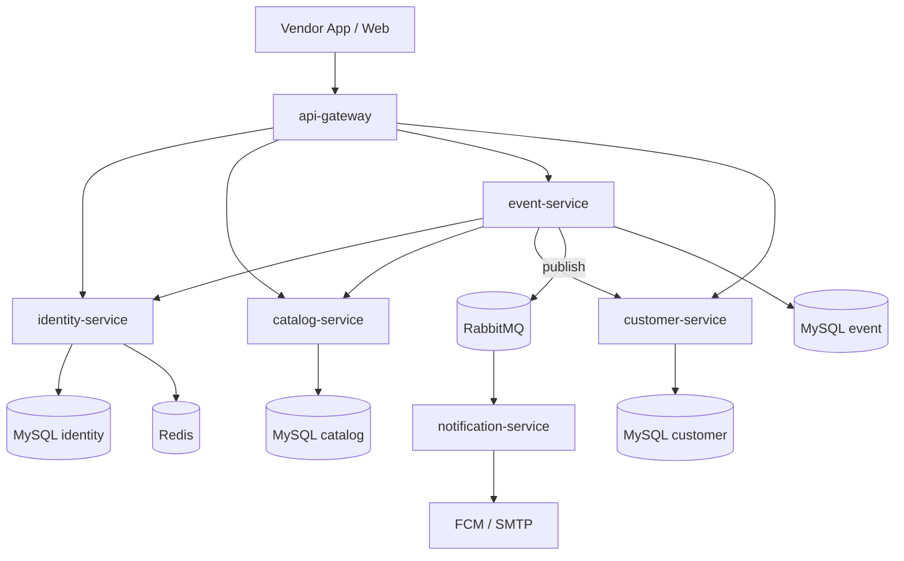

# Event Platform — Kế hoạch Microservices + Flutter

2026-09-17 · @Someone

## Tổng quan & quyết định kiến trúc

Dự án chuyển từ "app quản lý 1 đội lân" thành một **marketplace đa dịch vụ event**: nhiều loại vendor (đội lân, ban nhạc, MC, trang trí, quay chụp...) cùng hoạt động trên 1 sàn, mỗi vendor là 1 tenant độc lập. Lân sư rồng là vertical đầu tiên để làm mẫu và kiểm chứng kiến trúc trước khi mở roỗng loại vendor khác.

**Quyết định đã chốt:**

- Gi·ªØ Java/Spring Boot, t√°ch th„†nh microservices ‚Äî kh√¥ng vi·∫øt l·∫°i b·∫±ng NestJS.
- Giữ ngguyên domain model đã có trong BE_Event_Platform (Event, UserEvent, Customer, Tenant, User/Role/Permission), chỉ thiết kế lại kinến trúc triển khai.
- Lam một mình, không có tester → mỗi giai đoạn phải có Definition of Done tự kiểm tra được bằng Postman/tay, không phụ thuộc người khác xác nhận.
- Không gấp tiến độ, ưu tiên làm chắc từng phần hơn tốc độ.
- MVP giữ đầy đủ tính năng cũ (sàn đẩy show, vendor accept/reject, gán thành viên, check-in/out, dashboard, CRM khách hàng) làm nền, chưa cắt bớt.
- MVP giữ cơ chế **"sàn đẩy show"** như bản gốc — khách hàng tự chọn thẳng vendor là hướng phát triển sau này, chưa thiết kế luồng chi tiết ngay, chỉ để chỗ mở trong domain.
- Web quản trị sàn (Next.js) và web/app cho khách tự đặt show → làm ở giai đoạn sau, sau khi vendor app + BE microservices chạy ổn.
- Giữ nguyên hạ tầng đã dùng: MySQL, Redis, JWT, FCM push, SMTP Gmail — mang sang từng service tương ứng theo ranh giới bounded context.

## So do microservices

6 service, gateway lam cong vao duy nhat, giao tiep dong bo REST giua service, RabbitMQ chi dung cho notification (bat dong bo).

| Service | Trach nhiem | Du lieu / DB | Ghi chu |
| --- | --- | --- | --- |
| api-gateway | Route request, xac thuc JWT tap trung truoc khi forward | Khong co DB | Spring Cloud Gateway hoac Nginx |
| identity-service | Auth (login/register/refresh token), User, Tenant, Role, Permission | MySQL rieng + Redis (session/cache) | Nen tang bat buoc lam truoc tien, JWT secret dung chung stateless |
| catalog-service | Loai dich vu vendor (lan su rong, ban nhac, MC...), ho so cong khai vendor | MySQL rieng | Moi hoan toan so voi BE cu, tach de sau nay them loai vendor khong dong BE khac |
| event-service | Event/booking, gan thanh vien (UserEvent), check-in/out, luong theo show, dashboard | MySQL rieng | Trai tim he thong, goi REST sang identity/catalog/customer khi can du lieu, publish message len RabbitMQ |
| customer-service | CRM khach hang, phan loai, nguoi phu trach | MySQL rieng | Giu nguyen logic cu |
| notification-service | Nghe RabbitMQ, ban FCM push + email | Khong can DB rieng (co the co log nho) | Tach roi hoan toan, khong bi goi truc tiep tu service khac |

Giao tiep noi bo: goi REST truc tiep dong bo giua cac service khi can du lieu ngay (vi du event-service can ten tenant tu identity-service). RabbitMQ chi danh cho notification de khong lam cham response chinh.

## Domain model giữ nguyên

Toàn bộ entity nghiệp vụ từ BE\_Event\_Platform (viết Tết 2026) được mang sang nguyên vẹn, chỉ phân bổ lại vào đúng service phụ trách.

| Entity cũ | Chuyển vào service | Thay đổi |
| --- | --- | --- |
| User, Role, Permission, Tenant | identity-service | Không đổi logic, chỉ tách khỏi các entity khác |
| Event, EventType, EventStatus | event-service | Không đổi |
| UserEvent, AssignStatus | event-service | Không đổi — vẫn giữ vòng đời PENDING → ACCEPTED/REJECTED → CHECKED\_IN → CHECKED\_OUT |
| Customer, CustomerType | customer-service | Không đổi |
| *(mới)* ServiceCategory / VendorProfile | catalog-service | Thêm mới để tổng quát hoá đa loại vendor — Tenant sẽ tham chiếu tới 1 ServiceCategory thay vì hardcode lân sư rồng |

Ghi chú: trường `platformFee` trên Event vẫn giữ nguyên vai trò — đây là cơ chế thu phí hoa hồng của sàn, không đổi ở giai đoạn này.

## Roadmap theo giai doan

Moi giai doan co Definition of Done (DoD) de tu kiem tra bang Postman hoac thao tac tay, khong can tester.

| Giai doan | Noi dung | Definition of Done | Due date |
| --- | --- | --- | --- |
| Phase 0 | Chuan bi workspace, Docker Compose (MySQL, Redis, RabbitMQ), shared Maven module | docker compose up chay duoc toan bo infra rong | 2026-09-24 |
| Phase 1 | identity-service: auth, tenant, user, role, permission | Postman: dang ky tenant, login ra JWT, goi API co bao ve thanh cong | 2026-10-15 |
| Phase 2 | event-service: event, assign thanh vien, accept reject, check-in check-out, dashboard | Chay full luong show tu tao den check-out bang Postman | 2026-11-12 |
| Phase 3 | customer-service: CRM khach hang | CRUD khach hang, gan khach vao show | 2026-11-19 |
| Phase 4 | catalog-service: loai vendor, ho so vendor cong khai | Tao duoc it nhat 2 loai vendor khac nhau | 2026-11-26 |
| Phase 5 | notification-service + RabbitMQ | Gan thanh vien nhan duoc push FCM thuc te | 2026-12-03 |
| Phase 6 | api-gateway + Nginx + Docker Compose tong the | Goi API qua 1 cong duy nhat | 2026-12-10 |
| Phase 7 | Flutter vendor app theo base rencity-host | Dang nhap, xem show, gan thanh vien, check-in check-out tren app thuc te | 2027-01-14 |
| Integration + Deploy FPT Cloud | Noi toan bo service qua gateway, deploy len FPT Cloud, chay thu voi du lieu thuc | He thong chay on dinh tren moi truong production | 2027-01-28 |
| Phase 8 | Web admin san (Next.js) | Duyet vendor, xem doanh thu toan san | Sau Tet 2027 |
| Phase 9 | Web/app khach tu dat show | Khach xem danh sach vendor va gui yeu cau dat show | Sau Tet 2027 |

Thu tu uu tien: Phase 0 den 2 la nen tang bat buoc lam truoc, Phase 3-6 co the doi thu tu tuy nhu cau thuc te, Phase 7 (Flutter) nen bat dau song song tu khi Phase 2 on dinh de co API thuc de noi.

**Danh gia kha thi:** Tet Nguyen Dan 2027 (mung 1 Tet) roi vao 2027-02-06, tuc con khoang 20 tuan tinh tu hom nay. Lich tren gia dinh lam ngoai gio lam chinh thuc (ban van full-time Tech Lead o Rencity), moi phase co buffer nhung Phase 2 (event-service) va Phase 7 (Flutter) la 2 phase nang nhat, de tre tien do nhat neu phat sinh van de. De kip deploy truoc Tet, nen bat dau Phase 7 (Flutter) ngay khi Phase 1-2 co API on dinh (song song voi Phase 3-6), khong doi lam xong toan bo BE moi bat dau nhu de xuat tuan tu ban dau - day cung la cau tra loi cho comment minh de lai truoc do. Phase 8 va 9 (web admin san, web khach tu dat show) danh sau Tet, khong nam trong deadline nay.

## Checklist tien do chi tiet

Cap nhat truc tiep vao day khi lam xong tung task.

### Phase 0 - Chuan bi nen tang

- [ ] Tao cau truc workspace tai /Volumes/Code/event\_app
- [ ] Docker Compose: MySQL, Redis, RabbitMQ chay duoc
- [ ] Shared Maven module: JWT filter, exception handler chung
- [ ] Doi mat khau SMTP Gmail dang lo trong code cu, chuyen sang bien moi truong

### Phase 1 - identity-service

- [ ] Entity User, Role, Permission, Tenant
- [ ] API register tenant + user dau tien
- [ ] API login tra JWT
- [ ] API refresh token
- [ ] RBAC: check permission qua annotation
- [ ] Test Postman toan bo flow auth

### Phase 2 - event-service

- [ ] Entity Event, EventType, EventStatus, UserEvent, AssignStatus
- [ ] API tao show (goi tu phia san)
- [ ] API accept/reject show
- [ ] API gan thanh vien vao show
- [ ] API respond nhan/tu choi assignment
- [ ] API check-in tap trung, check-in diem dien, check-out
- [ ] API dashboard/summary theo thang
- [ ] Publish message RabbitMQ khi gan thanh vien / doi trang thai
- [ ] Test Postman toan bo flow show tu dau den cuoi

### Phase 3 - customer-service

- [ ] Entity Customer, CustomerType
- [ ] CRUD khach hang
- [ ] Gan khach hang vao show khi tao event

### Phase 4 - catalog-service

- [ ] Entity ServiceCategory / VendorProfile
- [ ] API CRUD loai dich vu vendor
- [ ] Tenant tham chieu toi ServiceCategory

### Phase 5 - notification-service

- [ ] Consumer lang nghe RabbitMQ
- [ ] Ban FCM push khi duoc gan show
- [ ] Ban email khi can (vi du tu choi show)

### Phase 6 - api-gateway

- [ ] Cau hinh route toi tung service
- [ ] Xac thuc JWT tap trung o gateway
- [ ] Docker Compose chay toan bo he thong qua 1 cong

### Phase 7 - Flutter vendor app

- [ ] Tao project event\_app bang flutter create
- [ ] Copy core/ (network, base, env) tu rencity-host, doi domain
- [ ] Module splash, login, register
- [ ] Module navigator (bottom nav theo role admin/member)
- [ ] Module dashboard admin + member
- [ ] Module danh sach show, chi tiet show, gan thanh vien
- [ ] Module assignment cua member: nhan/tu choi, check-in/out
- [ ] Module quan ly khach hang
- [ ] Noi voi BE thuc te qua api-gateway

### Phase 8 - Web admin san

- [ ] Duyet vendor moi
- [ ] Xem doanh thu toan san

### Phase 9 - Web/app khach tu dat show

- [ ] Trang danh sach vendor theo loai dich vu
- [ ] Gui yeu cau dat show truc tiep toi vendor

## Ghi chu ky thuat, rui ro va quy uoc

- Mat khau SMTP Gmail dang nam plaintext trong application.properties cua BE cu - doi mat khau nay va chuyen toan bo secret (JWT secret, DB password, SMTP password, FCM key) sang bien moi truong hoac secret manager ngay tu Phase 0.
- JWT secret dung chung giua cac service (stateless) de tranh goi lai identity-service moi request - can dong bo secret qua bien moi truong giong nhau tren tat ca service.
- Goi REST dong bo giua service dung ten service trong Docker network (khong hardcode IP), cau hinh base URL qua bien moi truong de doi duoc khi deploy FPT Cloud.
- Database-per-service: moi service 1 database MySQL rieng, khong join truc tiep qua DB, chi lay du lieu qua API.
- RabbitMQ message can co idempotency (vi du dung event id) de tranh ban trung thong bao khi consumer retry.
- Domain model nen de san truong the hien ai la nguoi tao show (san hay khach hang) de sau nay mo rong sang Phase 9 khong phai thiet ke lai schema.
- Vi lam mot minh khong co tester, nen viet vai test tu dong co ban (unit test cho logic assign/check-in/check-out) cho event-service vi day la phan phuc tap nhat, tranh regression khi sua sau nay.
